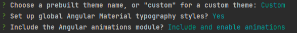
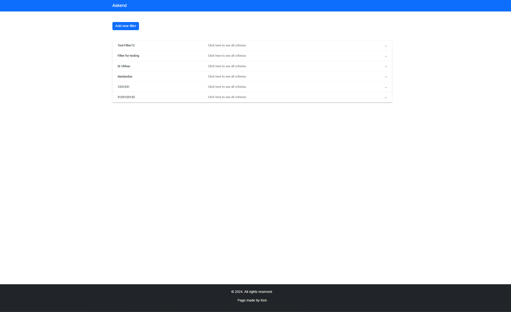
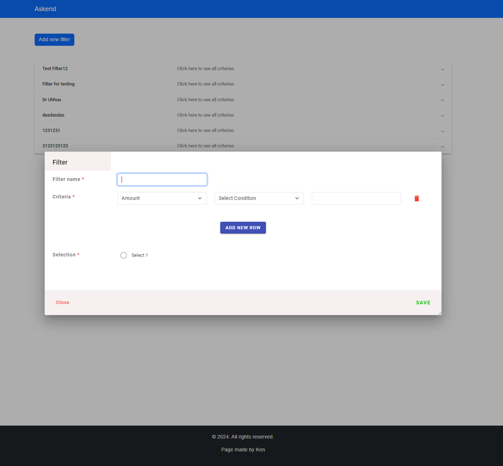
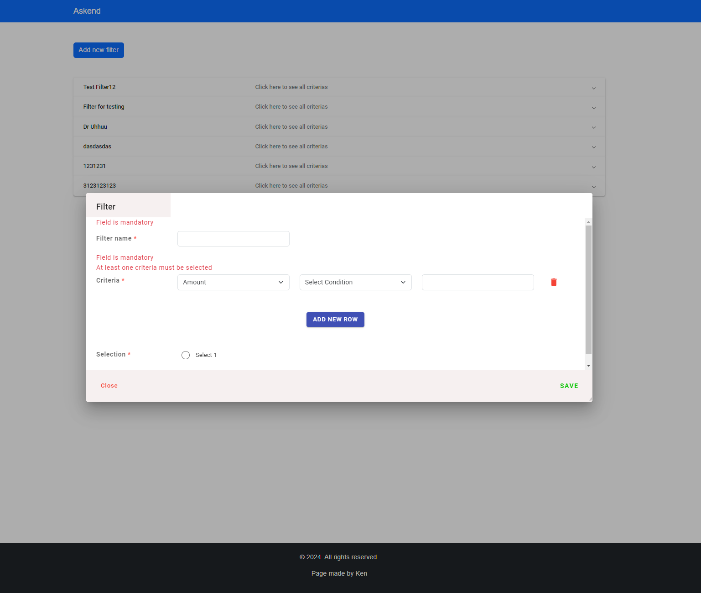

# Askend proovitöö
***

# BE Keskkonna seadistamine


## Andmebaasi loomine
+ Laadida alla endale docker. Nt: Docker Desktop
+ Kui Docker Engine töötab, kasutada käsku "**docker-compose up -d**"
+ Selle abil luuakse **askend** andmebaas ning käivitatakse container

**Nüüd saab luua ühenduse andmebaasiga (nt läbi IDE):**
- Host: **localhost:5430**
- Database name: **askend**
- User: **postgres**
- Password: **postgres**

**Peale andmebaasi containeri tööle panemist tuleks käivitada Java rakendus, selle käigus laetakse scriptidega ka TEST-andmed.**

## Java seadistamine

+ Kui pole olemas, siis laadida alla [Java versiooniga 19](https://www.oracle.com/java/technologies/javase/jdk19-archive-downloads.html)
+ Versiooni saab kontrollida käsuga:```java -version```
+ Sobib installeri kasutamine
+ Kui jookstamisega tekib probleeme või Intellij ei näita Java versiooni, siis veenduda, et **JAVA_HOME** ning **Path** on õigesti seadistatud
+ Samuti seadistada projekt JDK 19 peale

## Maveni seadistamine

+ Kui pole olemas, siis laadida alla [Maven Versiooniga 3.8](https://maven.apache.org/download.cgi), sobib 3.8.8
+ Alla laetud kaust lahti pakkida **Program Files** kausta.
+ Seadistada Environment Variables **MAVEN_HOME** ning **PATH**.

## Keskkonna jooksutamine
Jooksutada **AskendApplication.java** ning BE hakkab tööle
***


# Frontend
***

# Askend App


Make sure you have npm installed.

Run "**npm install**" to install necessary dependencies and also **"ng add @angular/material"**
(otherwise some features will not work!)

While installing Angular Material then follow this:


Now, go make sure to be in correct place: **"cd .\frontend\askend-app\"**

Run **"ng serve"**, happy coding! :)


This project was generated with [Angular CLI](https://github.com/angular/angular-cli) version 17.2.0.

## Development server

Run `ng serve` for a dev server. Navigate to `http://localhost:4200/`. The application will automatically reload if you change any of the source files.

## Code scaffolding

Run `ng generate component component-name` to generate a new component. You can also use `ng generate directive|pipe|service|class|guard|interface|enum|module`.

## Build

Run `ng build` to build the project. The build artifacts will be stored in the `dist/` directory.

## Running unit tests

Run `ng test` to execute the unit tests via [Karma](https://karma-runner.github.io).

## Running end-to-end tests

Run `ng e2e` to execute the end-to-end tests via a platform of your choice. To use this command, you need to first add a package that implements end-to-end testing capabilities.

## Further help

To get more help on the Angular CLI use `ng help` or go check out the [Angular CLI Overview and Command Reference](https://angular.io/cli) page.


# Some pictures as well:

## Height can be asjusted from right bottom corner of the modal.



## Autor:
### Ken Lilloja